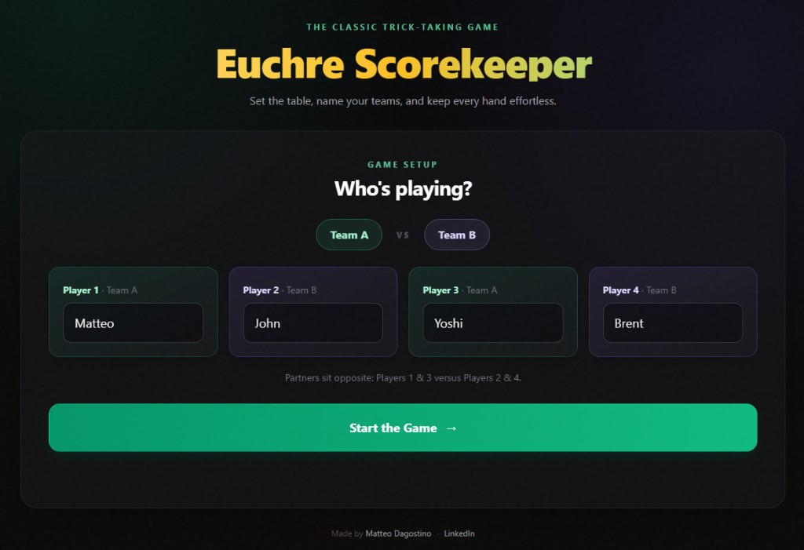
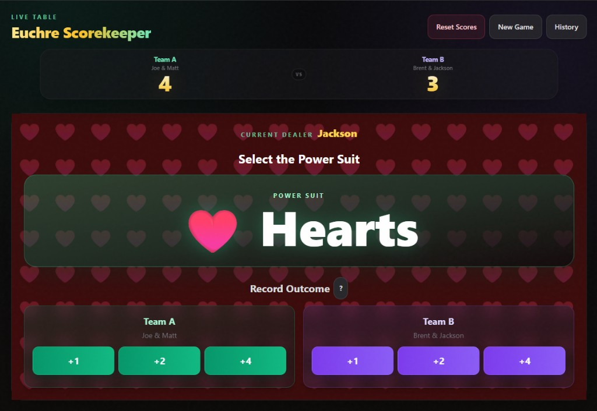
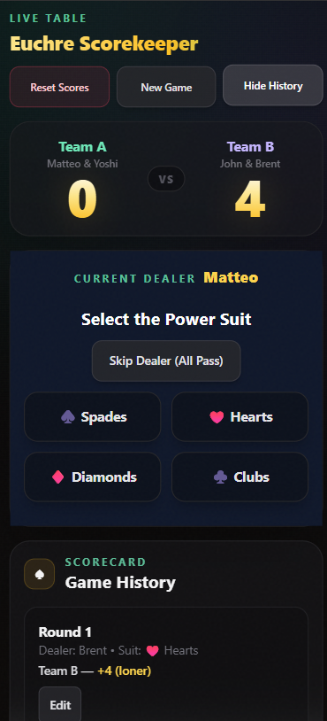

# Euchre Scorekeeper

A fast, responsive, and rules-aware scorekeeping interface for four-player Euchre.


Euchre Scorekeeper provides a focused game-day workflow: configure two teams, select the opening dealer, record each hand in one tap, correct historical entries, and review a complete statistical summary when a team reaches 10 points. The application is entirely client-side and requires no account, API key, or backend service.

## Visual Showcase & Screenshots

### Core views





### Mobile experience



## Product Capabilities

- Four-player setup with editable team names and fixed partner pairings.
- Explicit opening-dealer selection and automatic clockwise dealer rotation.
- Trump selection for Spades, Hearts, Diamonds, and Clubs.
- One-tap scoring for standard hands, euchres, and successful loners.
- Sticky, animated scoreboard optimized for desktop and mobile play.
- Round history with inline correction and deterministic score/stat recomputation.
- Automatic game completion at 10 points.
- Post-game reporting for rounds, skips, trump frequency, team calls, euchres, and loners.
- Separate **Play Again**, **Reset Scores**, and **New Game** lifecycle controls.

## Technology Stack

- **React 19** — component rendering and local state management.
- **Vite 5** — development server and production bundling.
- **Tailwind CSS 3** — responsive utility styling and design tokens.
- **Framer Motion 12** — scoreboard and trump-selection transitions.
- **ESLint 9** — static analysis and code-quality checks.

## Getting Started

### Prerequisites

- Node.js 18 or later.
- npm 9 or later.

### Local development

```bash
git clone <repository-url>
cd euchre-scorekeeper
npm install
npm run dev
```

Open `http://localhost:5173` in a browser. Vite reloads the application automatically when source files change.

### Available commands

```bash
npm run dev      # Start the Vite development server
npm run build    # Create an optimized production bundle
npm run preview  # Serve the production bundle locally
npm run lint     # Run ESLint across the repository
```

## Project Architecture

```text
euchre-scorekeeper/
├── src/
│   ├── App.jsx              # Game state, rules, workflows, and rendered views
│   ├── main.jsx             # React application bootstrap
│   ├── index.css            # Tailwind layers and global design system
│   └── App.css              # Legacy stylesheet retained in the repository
├── index.html               # Vite HTML entry point
├── tailwind.config.js       # Tailwind content paths and theme extensions
├── postcss.config.js        # PostCSS/Tailwind processing
├── vite.config.js           # Vite React plugin configuration
├── eslint.config.js         # Repository lint rules
└── package.json             # Dependencies and lifecycle scripts
```

### Runtime boundaries

The application is a single-page client application with two React component boundaries:

- `App` owns the complete game session, all rules, navigation states, and aggregate statistics.
- `HistoryItem` owns temporary edit controls for one historical round and emits a normalized event through `onUpdate`.

There is no router, global store, persistence layer, or network API. View changes are derived directly from `App` state:

1. `gameStarted === false` renders player and team setup.
2. `selectingDealer === true` renders opening-dealer selection.
3. `gameEnded === true` and a non-null `winner` render the final report.
4. All other states render the active scoreboard and round controls.

## Core Game Logic Workflows

### 1. Session initialization

1. Four player names are entered and normalized by `formatName`.
2. `startGame` validates that every player has a non-empty name.
3. The user selects the opening dealer.
4. `currentDealer` and `initialDealer` are set to the selected player index.

Team membership is index-based and remains stable for the session:

- Team 0: players `0` and `2`.
- Team 1: players `1` and `3`.

### 2. Round lifecycle

1. The active dealer is read from `players[currentDealer]`.
2. `handleTrumpSelect` stores the selected suit and advances `roundStep` to `score`.
3. `handleOutcome(team, outcome)` maps the selected result to points and identifies the calling team.
4. `handleRoundEnd` updates scores, statistics, and round history.
5. If neither team has reached 10 points, the dealer advances with `(currentDealer + 1) % 4`.
6. Trump, caller, and round UI state reset for the next hand.

### 3. Scoring matrix

- `plus1` — selected team receives 1 point; that team is the caller.
- `euchre` — selected defending team receives 2 points; the opposite team is recorded as the caller.
- `loner` — selected team receives 4 points; that team is the caller.
- `skip` — no points are awarded; the skipped-round counter increments and the dealer advances.

The UI labels the 2-point action as a euchre. Internally, the statistics model also supports tracking a two-point result through the same round event shape.

### 4. Win detection

After each scored round, `handleRoundEnd` evaluates both updated team totals. The first team at or above 10 points becomes `winner`, and `gameEnded` switches the interface to the final report. No additional dealer rotation or round reset occurs after a winning hand.

### 5. History correction

`HistoryItem` converts edited fields back into a normalized event and passes it to `App`. `recomputeFromHistory` then:

1. Rebuilds scores from zero.
2. Rebuilds all aggregate statistics from zero.
3. Recalculates the current dealer from `initialDealer` and event count.
4. Resets in-progress round controls.
5. Re-evaluates the winner and game-ended state.

This event-replay model makes historical correction deterministic and prevents aggregate values from drifting away from their source events.

### 6. Session reset behavior

- `resetGame` clears scores, current round state, winner state, and statistics while retaining players, teams, and the active game screen.
- `playAgain` retains player and team names, clears game results, and requests a new opening dealer.
- `newGame` clears players and all game state, returning to setup.

## State Specification

### Session and navigation state

- `gameStarted: boolean` — indicates whether setup has completed.
- `gameEnded: boolean` — indicates that a team has reached the winning threshold.
- `winner: 0 | 1 | null` — index of the winning team.
- `players: string[4]` — player names in seat order.
- `teamNames: { team0: string; team1: string }` — editable display names.
- `editingTeam: 0 | 1 | null` — team currently being renamed.
- `selectingDealer: boolean` — controls the opening-dealer view.
- `showHistory: boolean` — controls history-panel visibility.
- `showScoreHelp: boolean` — controls the scoring-help popover.

### Round state

- `scores: [number, number]` — cumulative team scores.
- `currentDealer: 0 | 1 | 2 | 3` — active dealer seat.
- `initialDealer: 0 | 1 | 2 | 3 | null` — opening dealer used for replay calculations.
- `trump: string` — selected display value, for example `♥️ Hearts`.
- `trumpTeam: 0 | 1 | null` — team that called trump.
- `roundPoints: [number, number]` — per-team round points retained by the round model.
- `roundStep: 'selectSuit' | 'score'` — active round workflow stage.
- `history: RoundEvent[]` — ordered event log for scored and skipped rounds.

### Presentation state

- `animateScore: [boolean, boolean]` — transient score animation flags.
- `trumpAnimation: boolean` — transient trump-selection animation flag.
- `showSuitOptions: boolean` — suit-option visibility state retained by the current implementation.

### Statistics state

```ts
interface GameStats {
  trumpTeam0: number
  trumpTeam1: number
  trumpSuits: {
    Spades: number
    Hearts: number
    Diamonds: number
    Clubs: number
  }
  roundsPlayed: number
  skippedRounds: number
  roundsWonByTeam: [number, number]
  pointsByTeam: {
    team0: { p1: number; p2: number; p4: number }
    team1: { p1: number; p2: number; p4: number }
  }
  euchreEvents: number
  lonerEvents: number
  euchreByTeam: [number, number]
  lonerByTeam: [number, number]
}
```

## Internal API Specification

The project does not expose an HTTP or package API. The interfaces below document the internal contracts used by the React components and game engine.

### `RoundEvent`

```ts
interface RoundEvent {
  id: number
  round: number
  dealerIdx: 0 | 1 | 2 | 3
  trumpSuit: string
  callerTeam: 0 | 1 | null
  scoringTeam: 0 | 1 | null
  pointsAwarded: 0 | 1 | 2 | 4
  outcomeType: 'plus1' | 'euchre' | 'loner' | 'skip' | null
}
```

### `HistoryItem` props

```ts
interface HistoryItemProps {
  index: number
  event: RoundEvent
  teamLabel: string
  outcomeLabel: string
  suit: string
  teamNames: { team0: string; team1: string }
  dealerName: string
  onUpdate: (updatedEvent: RoundEvent) => void
}
```

### Core handlers

- `startGame(): void` — validates player names and opens dealer selection.
- `handleTrumpSelect(suit: string): void` — selects trump and opens scoring.
- `handleOutcome(team: 0 | 1, outcome: OutcomeType): void` — maps a UI outcome to points and caller metadata.
- `handleRoundEnd(points, callerTeam?, outcomeType?): void` — commits a round, updates statistics, checks for a winner, and advances play.
- `skipDealer(): void` — records an all-pass event and advances the dealer without scoring.
- `recomputeFromHistory(events: RoundEvent[]): void` — rebuilds scores, statistics, dealer position, and winner state.
- `resetGame(): void` — resets the current match.
- `playAgain(): void` — starts another match with the same players.
- `newGame(): void` — returns to a clean setup session.

## Production Build and Deployment

Create and validate the production bundle:

```bash
npm ci
npm run lint
npm run build
npm run preview
```

Vite writes deployable static assets to `dist/`. Any static host can serve this directory; no server-side rendering or runtime environment variables are required.

### Vercel

1. Import the repository into Vercel.
2. Select **Vite** as the framework preset.
3. Use `npm run build` as the build command.
4. Use `dist` as the output directory.
5. Deploy.

### Netlify

Configure the project with:

```toml
[build]
  command = "npm run build"
  publish = "dist"
```

### GitHub Pages

For a project site hosted below a repository subpath, set Vite's `base` option to the repository name before building:

```js
export default defineConfig({
  base: '/euchre-scorekeeper/',
  plugins: [react()],
})
```

Publish the generated `dist/` directory through a GitHub Actions workflow or the Pages deployment action. A custom domain or root-level Pages site may use `base: '/'`.

### Generic static hosting

Upload the contents of `dist/` to the host's public directory. Because the application has no client-side router, rewrite rules are not required for normal navigation.

## Quality and Operational Notes

- Game data is held in memory and is lost on page refresh or tab closure.
- The application makes no first-party network requests and stores no player information remotely.
- Production builds should be generated from a clean dependency install with `npm ci`.
- Validate setup, dealer selection, all scoring outcomes, history editing, and the 10-point winner transition before release.
- Test at narrow mobile widths because the scorekeeper is intended for use at the card table.

## Contributing

1. Create a focused feature branch.
2. Keep scoring and dealer-rotation behavior covered by manual or automated regression checks.
3. Run `npm run lint` and `npm run build`.
4. Submit a pull request describing user-visible behavior and verification steps.

## Roadmap

- Persist active sessions locally.
- Add undo/delete support for history events.
- Expand history editing to include suit and caller corrections.
- Add automated unit and end-to-end coverage for scoring workflows.
- Add installable Progressive Web App support.

## Attribution

Created by [Matteo Dagostino](https://github.com/matt-dagostino).
